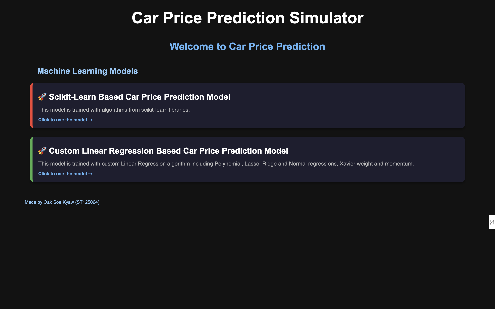

# Car Price Prediction Simulator V 2.0

## Author

**Student Name**: Oak Soe Kyaw
**Student ID**: ST125064

**Application Website**: [Car Prediction Simulator](https://st125064_02.ml.brain.cs.ait.ac.th/)

## Overview

The **Car Price Prediction Simulator** is a Flask-based web application designed to predict the selling price of a car based on user-provided parameters. It leverages two distinct **machine learning models**:

- **Old Model**: Uses a **Random Forest Regressor** trained on car price data.
- **New Model**: A **custom-built Linear Regression model** with feature scaling and polynomial transformation.

This version is **fully containerized using Docker**, making deployment and usage seamless across different environments.

---

## Features

1. **User-Friendly Web Interface**:

   - Pages: Landing Page, Prediction Page
   - Intuitive form-based input for entering car details.
   - Allows users to switch between two models for predictions.
   - Prediction history is maintained per session.
   - Clear history functionality for resetting predictions.

2. **Key Capabilities**:

   - Handles missing values by applying imputation techniques.
   - Allows users to make predictions based on essential car details such as year,max power, engine, owner, fuel, and transmission.

3. **Two Prediction Models**:
#### **Old Model (Random Forest Regressor)**
- A pre-trained **sckit learn based model** that predicts car prices based on past data.
- Handles **non-linearity and complex interactions** between car features.

#### **New Model (Custom Linear Regression)**
- **Polynomial Regression** with **Feature Scaling**.
- Trained with Polynomial, Lassoo, and Ridge regularization, xavier weight initialization, momentum and learning rates with 0.01, 0.001, and 0.0001.
- **Better interpretability** compared to Random Forest.

4. **Technology Stack**:

   - Backend: Python, Flask.
   - Frontend: HTML, CSS.
   - Machine Learning: Scikit-learn models
   - Algorithms: 
      - Old Model → Random Forest Regressor
      - New Model → Custom Linear Regression

5. **Dockerized Deployment**:
   - Fully containerized using Docker for easy deployment.
   - Ready-to-use `docker-compose` for launching the application.

---

## How to Use

### Running Locally

1. **Clone the Repository**:

```bash
git clone <https://github.com/Aizabell/AITML_A2.git>
```

2. **Set up a Virtual Environment**:

For Linux/Mac:

```bash
python3 -m venv venv
source venv/bin/activate
```

For Windows:

```bash
python -m venv venv
venv\Scripts\activate
```

3. **Install Dependencies**:

```bash
pip install -r requirements.txt
```

4. **Run the Application**:

```bash
cd app
python app.py
```

The application will be accessible at http://127.0.0.1:5001.

## Using Docker

1. **Build the Docker Image**:

```bash
# Build the Docker image in app directory
docker build -t harryphoebus/ml_assignment02:latest . 
```

2. **Run the Application**:

```bash
docker run -p 5001:5001 harryphoebus/ml_assignment02:latest
```

**Using Docker Compose**: Ensure the docker-compose.yml file is correctly set up, then run:

```bash
# Start the application in detached mode
docker-compose up -d
```

```bash
# Start the application in interactive mode
docker-compose up
```

## Access the Application

- Open your browser and navigate to:

```bash
http://localhost:5001
```

## Input Parameters

| Parameter        | Description                                       | Example        |
| ---------------- | ------------------------------------------------- | -------------- |
| **Year**         | Year the car was manufactured (Optional)          | `2015`         |
| **Max Power**    | Maximum power output of the car in bhp (Optional) | `80`           |
| **Engine**       | Engine capacity in CC (Optional)                  | `1500`         |
| **Owner**        | Ownership history                                 | First, Second  |
| **Fuel Type**    | Type of fuel the car uses                         | Petrol, Diesel |
| **Transmission** | Transmission type                                 | Manual, Auto   |

### Example Predictions

**Input:**

- Year: `2015`
- Max Power: `80 bhp`
- Engine: `1500 CC`
- Owner: `First`
- Fuel: `Petrol`
- Transmission: `Manual`

**Prediction**: `$12,500.00`

**Input:**

- Year: _(not provided)_
- Max Power: `100 bhp`
- Engine: `2000 CC`
- Owner: `Second`
- Fuel: `Diesel`
- Transmission: `Automatic`

**Prediction**: `$18,700.00`

---

## Screenshots

### Landing Page



### Old Model Page


### New Model Page


